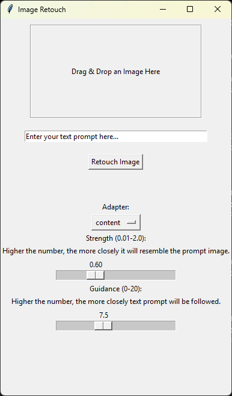

# retouch-image

Retouches an image following the given instructions, using an image-to-image model.



## Installing

1. Clone this repository to your local machine:
   ```shell
   git clone https://github.com/leo-cb/retouch-image.git
   ```
2. Install requirements:
    ```shell
    pip install -r requirements.txt
    ```
3. Create a .getimg_key file in the root directory with your getimg.ai API key to run the model.

## Usage

1. Run main.py with Python 3.12 for the program to execute the GUI:
```shell
python main.py
```
2. Drag an image to the drag-and-drop area and give it a prompt.

